# Algoritmos #

Sequência de regras pra resolver problemas.

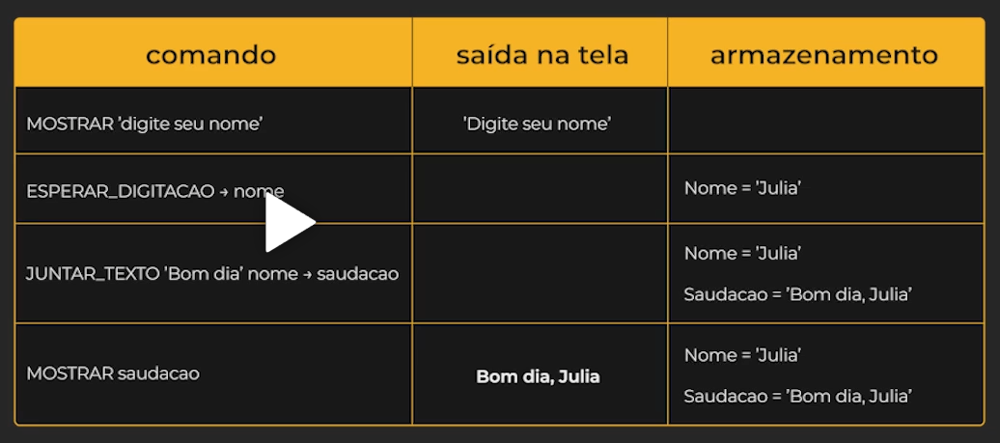

# Tipos de dados #

[Numéricos] - Inteiros e Pontos flutuantes (decinais, casa depois da virgula)
[texto] - sequência de carecteres
[booleano] - verdadeiro ou falso

Variável - identificador de um valor dentro da memoria do computer, tipo de coisa que pode guardar, e varia.

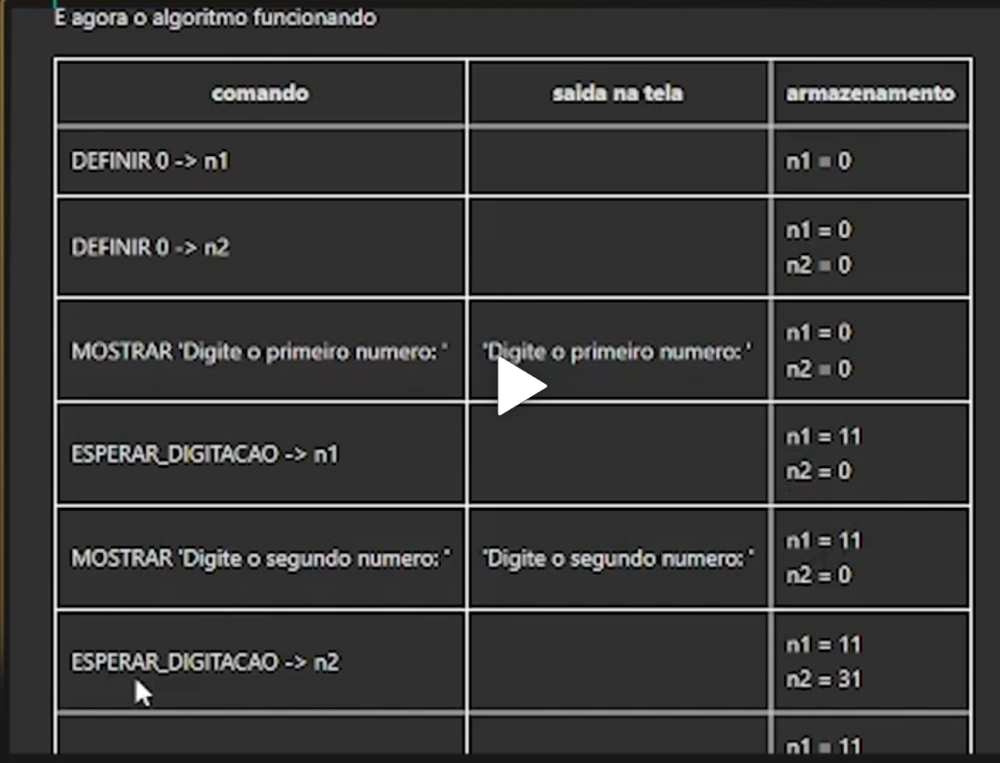

# Estruturas de decisão #

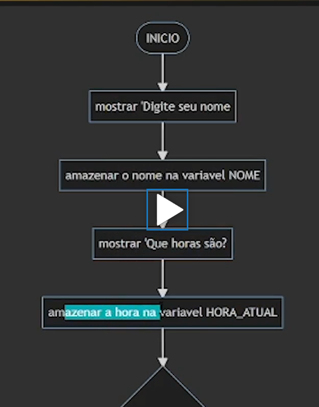

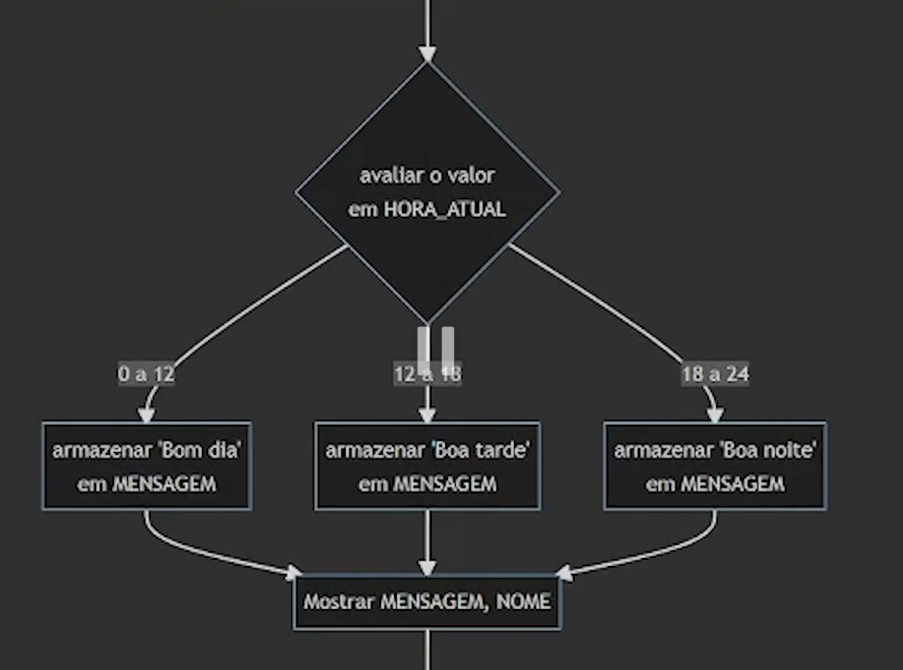

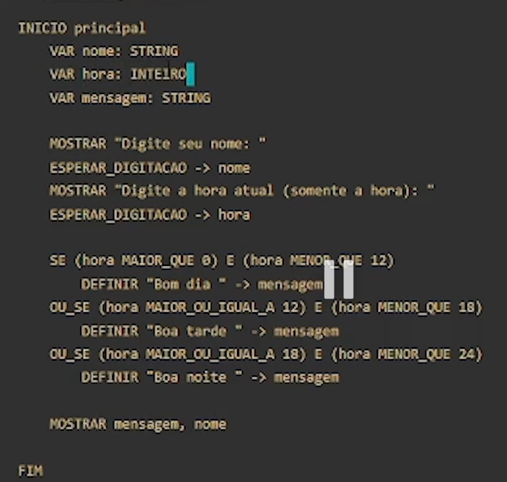

# Estruturas de repetição #

loop

iteração = quantas vezes passou pelo loop, se passou ali 5 vezes, então houveram 5 iterações.

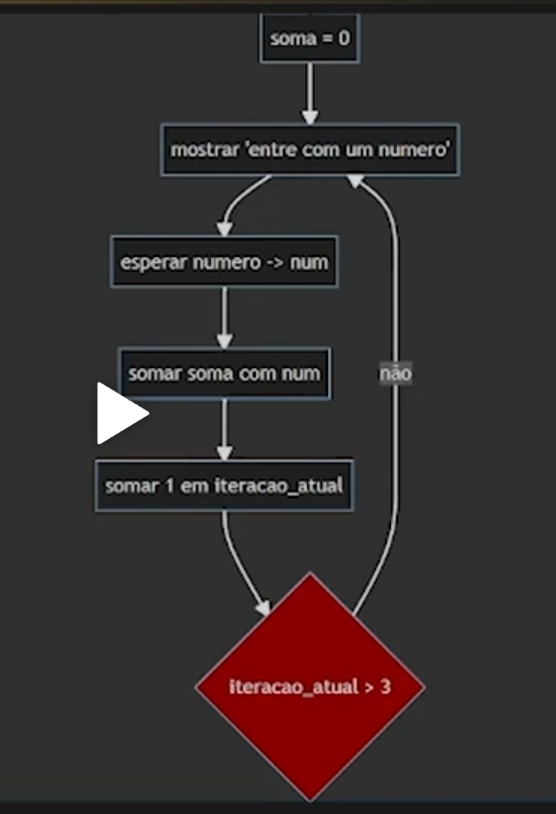

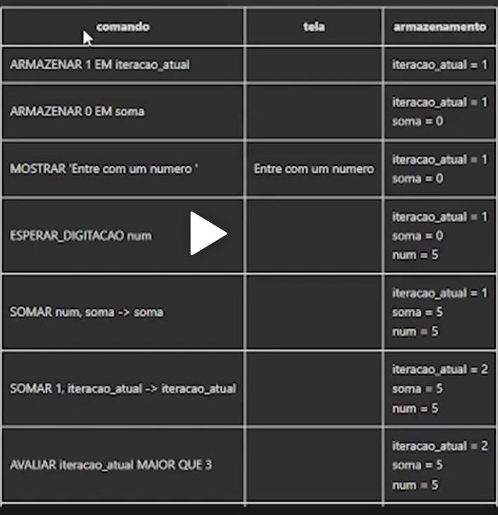

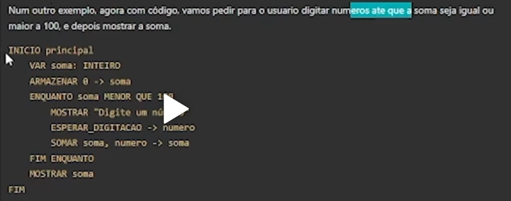

# Listas/Arrays #

Armazenam uma sequencia de dados na ordem qq sao colocados na lista, tipos diferentes ou um tipo só.

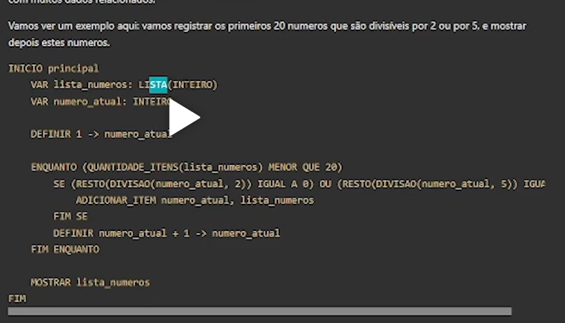

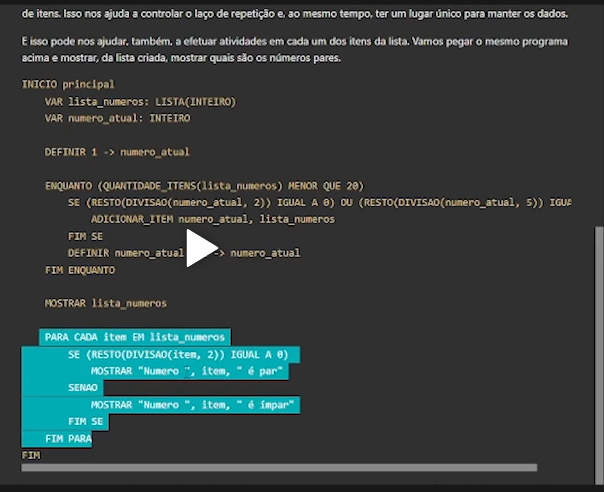

# Funções #

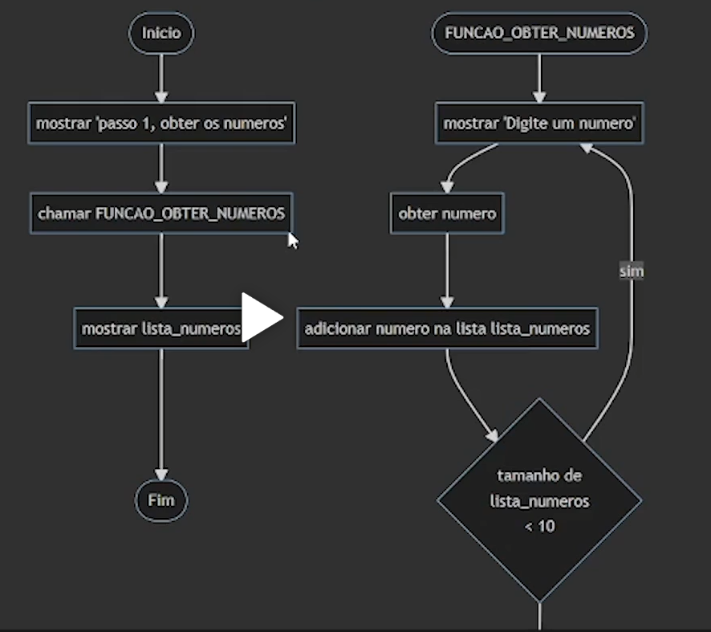

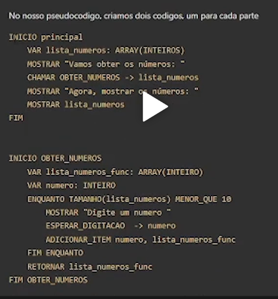

# Exercício #

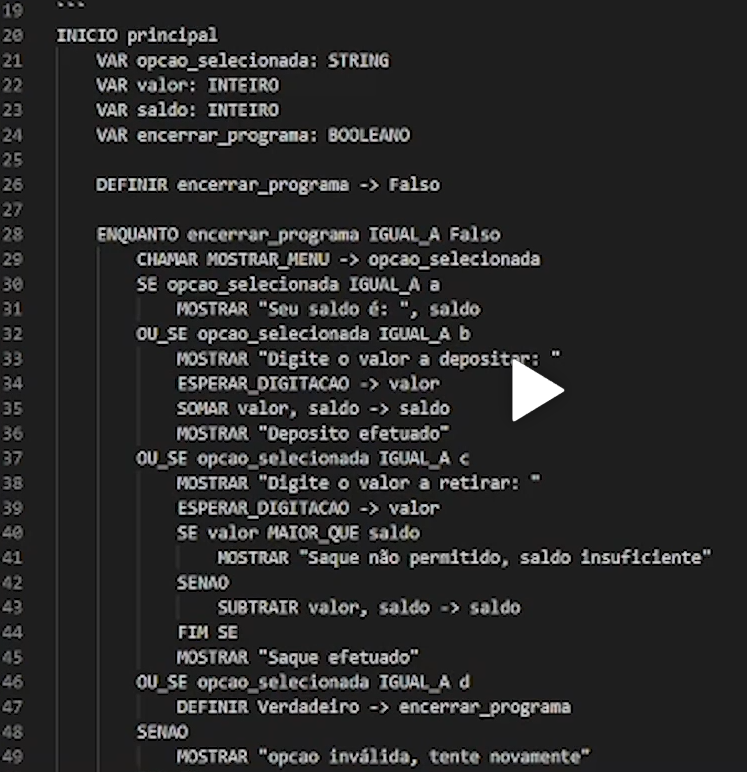

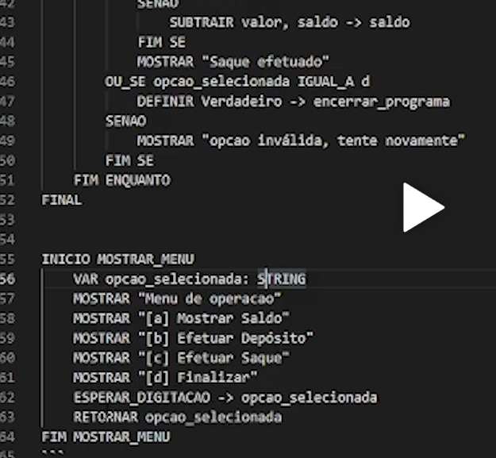

# Desempenho do algorítmo #

