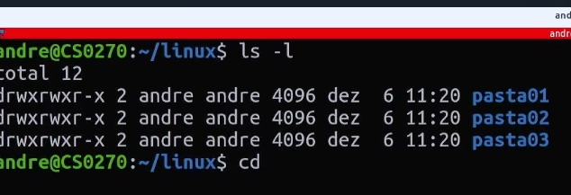

# O que é Linux #

Sistema operacional de código aberto, qualquer um tem acesso ao código fonte. Sistema aberto a alterações. Exemplo, podemos alterar alterações no sistema de uma empresa. Criado em 91, baseado em Unix.

Muito utilizado em servidores, celulares, android por exemplo é uma versão de linux, caixas eletronicos, smartvs, internet, sites, google, uol, receita, tudo baseado em linux.

Performance muito boa, consome pouco da maquina. 90% do trafego de internet do mundo passam por ambientes linux.

É muito seguro e flexível e capaz de customização. Programas gratuitos que foi criado por comunidades de pessoas. É muito mais seguro de baixar softwares.

Grande variedade de distribuições e variações para diferentes propósitos, várias versões.

Open Source - Origem. É de código aberto, posso propor mudanças, solução aos programas. 

Existem muitas distribuições chamadas por kernel, um exemplo é ubuntu, slax, fedora, são sistemas ooperacionais baseados em linux. Ubuntu tem foco em usabilidade, amigável ao usuário, primeira opção para alguem se aventurar no linux, ja vem com softwares e etc. Com essa quantidade de softwares tem alguns probleminhas. Debian já é voltado a estabilidade. 

CLI - Comand Line Interface, linhas de comando, terminal. é a telinha preta do linux.

GUI - Graphic User Interface - São as interfaces gráficas, Ubuntu por exemplo vem com a Gnome.

Tanto GUI quanto CLI servem para fazer operações no SO.

# Introdução ao terminal/bash #

Interagimos com SO através de comandos de texto.
Comandos do linux quase não variam de uma versão para outra.

Bash - Interpredor dos comandos, software por tras do terminal, avaliando o que fazer com os comandos.
Comando CAT - mostra conteúdos de arquivos. Ex: cat /nome da pasta /nome do arquivo. - cat /etc/issue - me mostra a versao no linux.
No terminal devo dizer de que forma ele deve abrir o arquivo, diferente de quando cliclo duas vzs e o SO define o que fazer.

# operações básicas no terminal #

cat - mostra conteúdo de um arquivo.
pwd - retorna em que diretório estou
whoami - mostra o usuario atual
cd - mudar para algum diretório. cd ~ = vai para a home. cd - = retorna ao diretório anterior. cd .. - retorna um diretório, um nível.
ls - lista o conteúdo do diretório. ls -l = mostra o conteúdo em lista por exemplo. ls -lr = da uma lista reversa. ls --help = traz todos os comandos possíveis com o ls.
clear - limpa a tela.

# Identificando e criando diretórios #

primeira letra quando dou ls - me diz se é arquivo ou diretório. d - é um diretório. se primeiro caractere for um - = significa que é arquivo e nao diretório.

Caminho relativo - Caminho que muda pra onde vou baseado em onde estou. cd .. vou cair em um lugar baseado onde estou.
Caminho absoluto - Caminho que nunca muda, sempre vai ser este caminho. cd /home/andre/linux. vai cair sempre neste diretório.

comando [touch] - cria qualquer tipo de arquivo. = touch arquivo-andre.
[mkdir] - make directory - cria um diretorio. = mkdir diretorio-andre. É possível criar diretórios dentro de diretórios sem precisar estar dentro dos mesmos. Ex: mkdir -p diretorio01/diretorio2/diretorio3
[tree] - mostra o conteúdo do diretório e dos outros diretórios dentro do diretório.

# Movimentando e apagando arquivos #

[mv] - move = mv arquivo-andre diretorio-andre
[cp] - copia = cp diretorio-andre/arquivo-andre .

Toda vez que digito um . no linux, significa o diretorio que estou agora. ^^^^

[Renomear-arquivo] - mv arquivo-andre arquivo = isso move um arquivo para o mesmo diretorio que ele esta.

[rm] - remove = não tem volta o que removemos no terminal, não tem lixeira = rm arquivo-andre.
Linux tem uma proteção para remover DIRETÓRIOS, então temos que usar da seguinte forma: rm -r (recursivo): rm -r diretorio01.
-d é para diretórios vazios apenas.

# Gerenciamento de pacotes no Linux #

A maioria dos softwares que eu for precisar eu nao preciso ficar buscando na internet, é muito imrpovavel que venha algo malicioso naquele pacote, muitos desenvolvedores estão de olho naquilo.

APT - Todo software que ele instala ele busca nos repositórios. Quando vou instalar um software no APT ele pega na propria maquina pois há uma lista deles. Preciso atualizar o cash dos meus repositórios para ter sempre as versões atualizadas dos softwares.

Comando apt update - atualiza os repositorios de software. Porém exige permissões de superusuario para funcionar.
[sudo] - super user do = entra como superusuario, admin. = sudo apt update. = atualizado.

apt install = instala software
sudo apt search text editor = busca softwares
sudo apt install vim

vim arquivo01.txt - abre com o software instalado.

sudo apt remove = remove app/software.

# edição de texto e editores #

vi
nano

vim - mais famoso - para escrever tem q entrar no modo de edição, com a tecla "i". Para sair do modo edição, usa tecla "esc".
Para dar ações no vim:
:w - salva o progresso
:q - sair, quit.
copiar e colar linha: yy = copiei, p = colar sempre cola na linha abaixo. dd = cortar, p = colar. Desfazer algo = u, para buscar algo, usar /, e apertar n vai levando aos proximos resultados, igual ctrl f do windows. ! = ignorar aviso, forçar ação.

cat teste.txt - mostra o conteúdo do arquivo.
head - começo do arquivo
tail - final do arquivo
less - mostra de uma forma que consigo ir rolando a pagina.

# compactação de arquivos #

Usada para fazer backup de arquivos
formato mais comum .tar.gz

Pra compactar, utilizamos o software [TAR]
comando: 

tar -cvf (compress, compactando)(verbose, mostrar na tela o que ta compactando)(f qual nome do arquivo a ser gerado)

tar -cvf linux.tar diretorio-andre/ - compacta tudo neste diretorio

Para descompactar:

tar -xvf(descompactar)(quero ver o q vai acontecer)(nome do que vou descompactar) 

rm linux.tar

tar-cvf linux2.tar * (wildcard, coringa) compacta tudo o que está no diretório.

rm -r diretorio-andre/ pasta01/ pasta02/ pasta03 teste.txt

tar - xvf linux2.tar (descompactar)

Primeiro compacta .tar depois .gz - fica mais compactado ainda.

tar -cvzf (z de gzip) arquivo de saida linux.tar.gz pasta0* (pega tudo depois do nome pasta0)

tar -xvzf linux.tar.gz (descompacta, mostra na tela, arquivo tipo z, e defino quem vou descompactar)

# Shell script e permissões #

Script para fazer as coisas

vim script.sh (extensão script, shell)
colocar uma linha no inicio dizendo qual interpretador de comandos ele interpretara o script

#!/bin/bash (ele que vai interpretar)
segundos="$1" - (diz q posso passar varios parametros para o sleep)

echo "."(terminal repete oq eu escrever)
sleep 1(adiciona pausa ate a execução da proxima coisa do script por um segundo)
echo ".."
sleep 1 $segundos
echo "..."
sleep 1 $segundos
echo "...."
sleep 1 $segundos
echo "....."
sleep 1 $segundos

esc

:wq

Para chamar o script, tenho que dar permissão ao script para executar. Lá no ls verificar após o tracinho do início as permissoes do arquivo, o q meu usuario pode fazer cm o arquivo (rw somente read and write)

para permitir:

chmod +x script.sh (permissao de execução)

./script.sh 2 ( executar o script e definindo como 2 segundos os sleeps)

#- uso para colocar comentarios tbm no texto ou script, lembretes.

# BUSCA DE ARQUIVOS E DIRETORIOS #

COMANDO FIND

