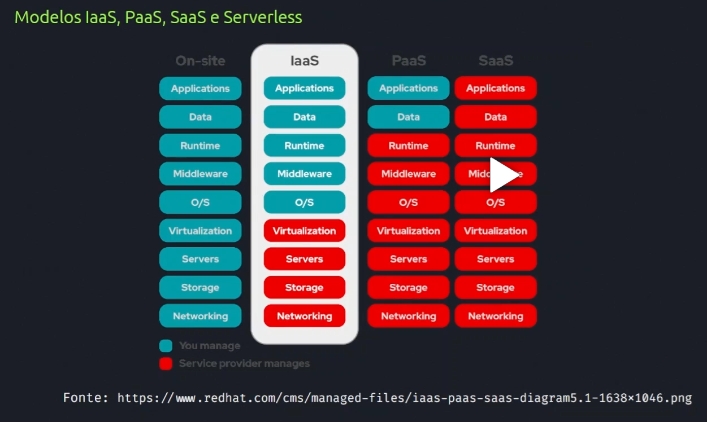
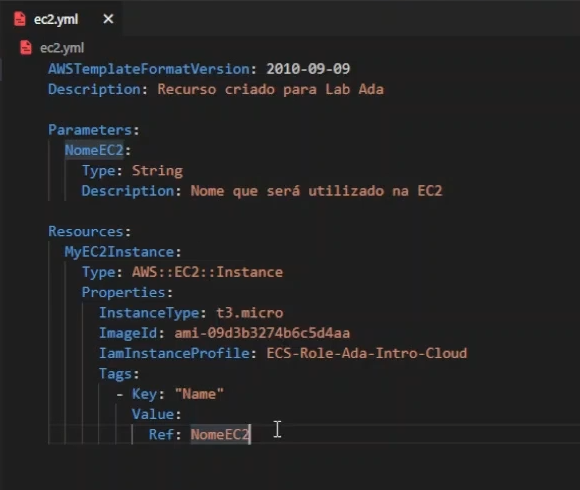
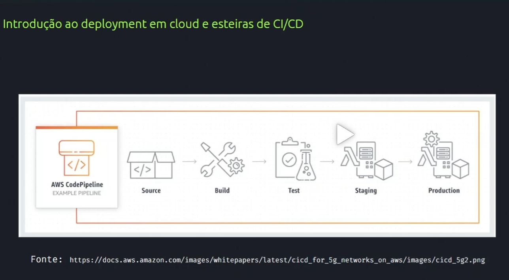

# O que é Linux #

Sistema operacional de código aberto, qualquer um tem acesso ao código fonte. Sistema aberto a alterações. Exemplo, podemos alterar alterações no sistema de uma empresa. Criado em 91, baseado em Unix.

Muito utilizado em servidores, celulares, android por exemplo é uma versão de linux, caixas eletronicos, smartvs, internet, sites, google, uol, receita, tudo baseado em linux.

Performance muito boa, consome pouco da maquina. 90% do trafego de internet do mundo passam por ambientes linux.

É muito seguro e flexível e capaz de customização. Programas gratuitos que foi criado por comunidades de pessoas. É muito mais seguro de baixar softwares.

Grande variedade de distribuições e variações para diferentes propósitos, várias versões.

Open Source - Origem. É de código aberto, posso propor mudanças, solução aos programas. 

Existem muitas distribuições chamadas por kernel, um exemplo é ubuntu, slax, fedora, são sistemas ooperacionais baseados em linux. Ubuntu tem foco em usabilidade, amigável ao usuário, primeira opção para alguem se aventurar no linux, ja vem com softwares e etc. Com essa quantidade de softwares tem alguns probleminhas. Debian já é voltado a estabilidade. 

CLI - Comand Line Interface, linhas de comando, terminal. é a telinha preta do linux.

GUI - Graphic User Interface - São as interfaces gráficas, Ubuntu por exemplo vem com a Gnome.

Tanto GUI quanto CLI servem para fazer operações no SO.

# Introdução ao terminal/bash #

Interagimos com SO através de comandos de texto.
Comandos do linux quase não variam de uma versão para outra.

Bash - Interpredor dos comandos, software por tras do terminal, avaliando o que fazer com os comandos.
Comando CAT - mostra conteúdos de arquivos. Ex: cat /nome da pasta /nome do arquivo. - cat /etc/issue - me mostra a versao no linux.
No terminal devo dizer de que forma ele deve abrir o arquivo, diferente de quando cliclo duas vzs e o SO define o que fazer.

# operações básicas no terminal #

cat - mostra conteúdo de um arquivo.
pwd - retorna em que diretório estou
whoami - mostra o usuario atual
cd - mudar para algum diretório. cd ~ = vai para a home. cd - = retorna ao diretório anterior. cd .. - retorna um diretório, um nível.
ls - lista o conteúdo do diretório. ls -l = mostra o conteúdo em lista por exemplo. ls -lr = da uma lista reversa. ls --help = traz todos os comandos possíveis com o ls.
clear - limpa a tela.

# Identificando e criando diretórios #

primeira letra quando dou ls - me diz se é arquivo ou diretório. d - é um diretório. se primeiro caractere for um - = significa que é arquivo e nao diretório.

Caminho relativo - Caminho que muda pra onde vou baseado em onde estou. cd .. vou cair em um lugar baseado onde estou.
Caminho absoluto - Caminho que nunca muda, sempre vai ser este caminho. cd /home/andre/linux. vai cair sempre neste diretório.

comando [touch] - cria qualquer tipo de arquivo. = touch arquivo-andre.
[mkdir] - make directory - cria um diretorio. = mkdir diretorio-andre. É possível criar diretórios dentro de diretórios sem precisar estar dentro dos mesmos. Ex: mkdir -p diretorio01/diretorio2/diretorio3
[tree] - mostra o conteúdo do diretório e dos outros diretórios dentro do diretório.

# Movimentando e apagando arquivos #

[mv] - move = mv arquivo-andre diretorio-andre
[cp] - copia = cp diretorio-andre/arquivo-andre .

Toda vez que digito um . no linux, significa o diretorio que estou agora. ^^^^

[Renomear-arquivo] - mv arquivo-andre arquivo = isso move um arquivo para o mesmo diretorio que ele esta.

[rm] - remove = não tem volta o que removemos no terminal, não tem lixeira = rm arquivo-andre.
Linux tem uma proteção para remover DIRETÓRIOS, então temos que usar da seguinte forma: rm -r (recursivo): rm -r diretorio01.
-d é para diretórios vazios apenas.

# Gerenciamento de pacotes no Linux #

A maioria dos softwares que eu for precisar eu nao preciso ficar buscando na internet, é muito imrpovavel que venha algo malicioso naquele pacote, muitos desenvolvedores estão de olho naquilo.

APT - Todo software que ele instala ele busca nos repositórios. Quando vou instalar um software no APT ele pega na propria maquina pois há uma lista deles. Preciso atualizar o cash dos meus repositórios para ter sempre as versões atualizadas dos softwares.

Comando apt update - atualiza os repositorios de software. Porém exige permissões de superusuario para funcionar.
[sudo] - super user do = entra como superusuario, admin. = sudo apt update. = atualizado.

apt install = instala software
sudo apt search text editor = busca softwares
sudo apt install vim

vim arquivo01.txt - abre com o software instalado.

sudo apt remove = remove app/software.

# edição de texto e editores #

vi
nano

vim - mais famoso - para escrever tem q entrar no modo de edição, com a tecla "i". Para sair do modo edição, usa tecla "esc".
Para dar ações no vim:
:w - salva o progresso
:q - sair, quit.
copiar e colar linha: yy = copiei, p = colar sempre cola na linha abaixo. dd = cortar, p = colar. Desfazer algo = u, para buscar algo, usar /, e apertar n vai levando aos proximos resultados, igual ctrl f do windows. ! = ignorar aviso, forçar ação.

cat teste.txt - mostra o conteúdo do arquivo.
head - começo do arquivo
tail - final do arquivo
less - mostra de uma forma que consigo ir rolando a pagina.

# compactação de arquivos #

Usada para fazer backup de arquivos
formato mais comum .tar.gz

Pra compactar, utilizamos o software [TAR]
comando: 

tar -cvf (compress, compactando)(verbose, mostrar na tela o que ta compactando)(f qual nome do arquivo a ser gerado)

tar -cvf linux.tar diretorio-andre/ - compacta tudo neste diretorio

Para descompactar:

tar -xvf(descompactar)(quero ver o q vai acontecer)(nome do que vou descompactar) 

rm linux.tar

tar-cvf linux2.tar * (wildcard, coringa) compacta tudo o que está no diretório.

rm -r diretorio-andre/ pasta01/ pasta02/ pasta03 teste.txt

tar - xvf linux2.tar (descompactar)

Primeiro compacta .tar depois .gz - fica mais compactado ainda.

tar -cvzf (z de gzip) arquivo de saida linux.tar.gz pasta0* (pega tudo depois do nome pasta0)

tar -xvzf linux.tar.gz (descompacta, mostra na tela, arquivo tipo z, e defino quem vou descompactar)

# Shell script e permissões #

Script para fazer as coisas

vim script.sh (extensão script, shell)
colocar uma linha no inicio dizendo qual interpretador de comandos ele interpretara o script

#!/bin/bash (ele que vai interpretar)
segundos="$1" - (diz q posso passar varios parametros para o sleep)

echo "."(terminal repete oq eu escrever)
sleep 1(adiciona pausa ate a execução da proxima coisa do script por um segundo)
echo ".."
sleep 1 $segundos
echo "..."
sleep 1 $segundos
echo "...."
sleep 1 $segundos
echo "....."
sleep 1 $segundos

esc

:wq

Para chamar o script, tenho que dar permissão ao script para executar. Lá no ls verificar após o tracinho do início as permissoes do arquivo, o q meu usuario pode fazer cm o arquivo (rw somente read and write)

para permitir:

chmod +x script.sh (permissao de execução)

./script.sh 2 ( executar o script e definindo como 2 segundos os sleeps)

#- uso para colocar comentarios tbm no texto ou script, lembretes.

# BUSCA DE ARQUIVOS E DIRETORIOS #

COMANDO FIND - buscar o script= posso especificar um caminho para iniciar a busca

find /home/andre - name "script.sh"

CTRL C = aborta execução.

find /home/andre - name "script.sh" -type f (tipo file) = elimina alguns tipos de arquivo da busca dele, achando mais rapido.

find / -mtime 5(busca arquivos alterados nos ultimos 5 dias) = usar sudo para ter todas as permissões

sudo find / -size +1MB (Busca arquivos por tamanho)

sudo find /home/andre -name "*.sh" -mtime 3 (busca todos os scripts, todos arquivos final .sh nos ultimos 3 dias)

find --help ( me da todas as possibilidades com find )

# Cloud Computing #

Datacenter - Local para fazer um centro de processamento de dados com diversas redundâncias, energia, internet, resfriamento, etc. Comporta servidores, storages, etc. 

Cloud privada - redhat, vmware. = provedor serviço de cloud privada para gerenciar.

Virtualização - Hypervisor = sistema que permite virtualizar os recursos, criando maquinas virtuais. por exemplo, posso dividir os 8gb de ram dividindo em 4 maquinas virtuais de 20gb.

Cloud Pública - AWS, Azure, google cloud, oracle, IBM = não precisa administrar nenhum datacenter, existem varios espalhados pelo mundo, me oferecendo todos os serviços em um console que posso acessar de qualquer lugar.

Híbrida - usa nuvem privada junto com publica.

# Modelos de utilização #

Servidor, onde centralizo as informações, um site por exemplo. 

On-site - sou responsável por adquirir e manter tudo, servidores, energia, disponibilizar fisicamente, virtualização, hypervisor, SO, recursos de aplicação, tudo. Gerencio do início ao fim.

IAAS - Infraestrutura como serviço. Não me preocupo com configurações de rede, quem passa cabos, quem configura, quem vai comprar e montar e virtualizar fica para o provedor, quero utilizar o serviço mas vc é responsável por isso. Cuido só do SO, da aplicação e dos dados que vou oferecer aos clientes. 

PaaS - Prover rede, virtualização, OS, é do provedor. Não quero mexer com sistema operacinal, apenas quero disponibilizar minha aplicação, meu programa e dados. 

SaaS - Não gerencio nada, o provider gerencia tudo, desde a aplicação até o networking. Como por exemplo o office365, é tudo online, só acesso o site do office e coloco minha planilha.

Serverless - Sem servidor, não preciso administrar meu servidor, coloco um codigo, python, java, e todo o gerenciamento de memoria, processamento, é gerenciado pelo provedor. sob demanda, executei, provisionei, derruba o ambiente.

# Principais serviços #

IAM - Gerenciador de usuários
EC2 - Serviço de provisionamento de instâncias.

Latência - Quanto mais perto eu estiver fisicamente do servidor, menor é a latência, velocidade maior.

RDS - Oferece plataforma como serviço, provisiona tudo, só preciso inserir meu esquema de banco de dados relacional.
dynamoDB - oferece estrutura de banco nao relacional, tenho tabelas independente entre elas e não tenho uma estrutra de como o banco deve funcionar.

Amazon S3 - Armazenamento de qualquer tipo de arquivo.

# Arquitetura Cloud #

Well Architected Framework - Padrão de boas práticas que a AWS com muitos fornecedores e clientes, com muitas instruçções de como construir aplicações seguras e confiáveis, e saudáveis.

- Excelência Operacional = Traz visão de execução, melhoria continua de processos, operar sistemas melhor excelencia
- Segurança - manter a aplicação mais segura possivel
- Confiabilidade - aplicação seja resiliente, suporte desastres recover, indisponibilidades, que possa voltar automaticamente
- Eficiência e Performance - alocar recursos da melhor forma possivel, qual servidor vai subir, com tanto de memoria, porque isso e etc.
- Otimização de custos  - redução de custo ao maximo, otimizar aplicação com gasto menor serveless.
- Sustentabilidade - Recente, a ideia é, como a aplicalção e infraestrutubra vai se comportar com relação a sustentabilidade do planeta. Um datacenter por exemplo, deve consumir baixa energia, baixa poluição, etc. 

Padrões de arquitetura

RESILIENCIA - Primeiramente deve ser resiliente, arquitetura pode sofrer, apanhar, ficar indisponível mas ela consegue voltar ao seu estado natural, de forma automática, autônoma.  RESILIENCIA.

ESCALABILIDADE - Considerar a possibilidade da aplicação sempre conseguir escalar, conseguir acompanhar o consumo, escala conforme a necessidade e volume, de 100 clientes a 1000 clientes de forma autônoma. Observar a demanda através de alarmes, metricas, etc.

PERFORMANCE -  Latência não pode ser alta, executa todo seu processo e tarefas no menor tempo possível e da melhor forma possível.

AUTOSCALING EC2 - Criei uma maquina virtual que escala automaticamente caso atinja 50% de seu uso por mais de 60 segundos, quando isso acontece é utilizado uma segunda instância, um outro pc.

# Infraestrutura como códigos #

Terraform é agnóstico, pode criar em qualquer servidor.
Cloudformation - Não agnóstico, é exclusivo aws, só permite criar recursos dentro da aws. Cria instancia através da stack (código), sem console, apenas importante o template (comandos).

# Deployment em Cloud e esteiras de CI/CD #

PIPELINE:
CI
Source - Onde codigo esta armazenado
Build - formalizar o executavel da aplicação, pronta pra ser testada
CD
Test - Teste automatizado
Staging - Homologação, stakeholders, gerente, é realmente o que vc precisa? É o que propomos a entregar?
Production - Entra em produção

CI = CONTINUOUS INTEGRATION - BOTAR CODIGO NO REPOSITORIO E SABER QUE ELE VAI RODAR A APLICAÇÃO.
CD - CONTINUOUS DELIVERY - ENTREGA CONTINUA, PEGO ARTEFADO E EXECUTO TESTE AUTOMATIZADO, INTEGRADO, TESTAR COMO UM TODO PRA VER SE REALMENTE FUNCIONOU, IMPLANTAÇÃO NA HOMOLOGAÇÃO, PRODUÇÃO.

Continuos Deployment - realiza toda a esteira sem precisar de aprovação.

# Segurança Lógica #

Segurança física, segurança lógica
treinamentos para colaboradores.
Trabalha com o mínimo de permissões possíveis para usuários.

Firewall
VPN
Backups

# TERRAFORM #

É uma ferramenta de infraasacode IAC, não criar mais ifra via console de forma repetida e manual, mas sim usar um template definido para fazer a automação deste processo.

Automação junto a propria cloud.

Terraform usa a linguagem em Go. e é mantido pela hashcorp.

É um código opensource, aberto o codigo fonte, assim como linux.

Ele é agnóstico, excuta em várias clouds (aws, azure, gcp)

# Workflow e lifecycle do Terraform #

