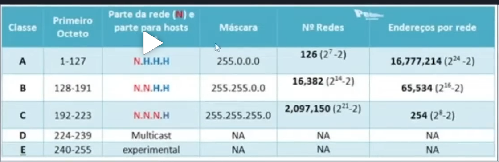

Redes - conexão entre dois ou mais dispositivos (cabos ou wireless)

# Origem #

Darpa - USA, forças armadas para universidades
Arpanet - princípios da internet,universidade trocou padroes com outros paises

Redes diferentes entre paises, nao conseguiam se comunicar.
Orgãos reguladores surgiram, para regularizar a comunicação entre essas redes, como ICAN, ISO, ANSI no mundo.

Internet virou comercial e corporativo (cisco, juniper) fazendo comunicação acontecer.
Oferece certificações.

# Infraestrutura de Rede #

[NIC] - Placa de rede -- recebe a comunicação do cabo de par trançado do switch, transmitindo ao pc.
Endereço físico - Mac adress - permite q o switch envie dados a maquina.
Endereço lógico - IP

[HUB] - Centralizador dos equipamentos.
Entrada RJ45, conecta pcs que se comunicam entre si, porém todos pcs falam entre sí, não fazem conexões diretas de um pc a outro.
Perdeu espaço para o switch.

[SWITCH] - Comutação, ou seja, troca ou encaminhamento de informações entre os dispositivos. Diferente do hub, permite conexões ponto a ponto, direto de um pc a outro. 24 ou 48 portas.

[Roteador] - Acha a melhor rota pra enviar nosso dado ao nosso destino, ex, enviar dado para os USA, encaminha para outros roteadores até o destino final, buscando a melhor rota, com menor tempo.

[Modem] - Tem um provedor de internet, provendo acesso a rede de várias formas, conexão via telefone, coaxial ou via fibra. Plugando o dispositivo diretamente a este modem para acessar a internet. Faz papel de modem e roteador falando em residências.

# Cabeamento Estruturado #

Estruturação dos cabos que interconectam os dispositivos, acontecem através de normas.

[Par-trançado] - mais conhecidos, com pares metalicos. UTP - cabo sem isolamento, pode ter ruidos, danos, etc. STP - cabo com isolamento, cobrindo as deficiências do UTP. Alumínio que envolve o cabo pra não ter interfeências externas.

[coaxial] - Composto por fios de cobre na malha, com um fio central sendo o condutor do pulso elétrico. Utilizado em modens, telefone, entrega de sinal ISP, tv a cabo.

[fibra-óptica] - Composto por pequenos pedaços de vidro, permitindo o sinal de luz se comunicar de uma ponta a outra. Velocidade da fibra é muito grande, mais do que as outras opções. Ligação entre continentes através de fibra óptica (back bone).

[Rack] - armário que hospeda os periféricos, switchs, cabos, roteadores, fibras, organizando em patch panels.

# Modelos OSI e TCP/IP #

## OSI ##
[Aplicação] - Camada mais próxima da realidade do usuario, informações do browser, protololo dns, que direciona ao domínio, protocolo ssh, direciona a um servidor remoto.
[APresentação] - Criptografia dos dados para fazer conexão segura, invulnerável, tanto dados da aplicação quanto decriptografar os dados da sessão.
[Sessão] - Camada responsável por estabelecer uma sessão entre a origem e destino final, ex. quero comunicar com vc por x minutos, de tal forma. Isso é estabelecido na sessão.

----- ^^ O que o usuário é próximo, que faz acontecer, o que ele manipula

[Transporte] - Responsável por conectar ao destino final, protocolos TCP e UDP. Diferença TCP envia um dado ao destino (segmento) informações do q está sendo enviado e ao enviar o TCP fala eu enviei o dado, vc recebeu? Destino confirma ou não. UDP manda os dados, destino estou mandando dados, não verifica se o dado chegou ou não. TCP - comunicações classicas, email, acesso de site, nao precisa de muita velocidade.
UDP - Utiliza em stream, ligação em sype, lives, não reenvia frames e etc, porém alta velocidade.

----- ^^ A nível de hardware, computadores, switchs, passam pra frente ou pra trás.

[Rede] - Onde acontece o envio dos dados de um roteador a outro e etc, quando a rede recebe, não é mais segmento, vira um pacote. FOrmei meus dados no pc, vira um pacote e precisa chegar em outro roteador, que ele consulta em uma tabela, vai direcionando os pacotes, até o destino final.

----- ^^ Envio a dispositivos

[Enlace] - Fragmenta os pacotes após receber da rede, fragmenta em quadros e envia aos destinos. Ex: Estou em rede local, no meu pc e meu colega tbm. Mandei mensagem pra ele, vai pro switch e do switch pro outro pc. No enlace pega o mac address, e manda para o mac.

[Física] - Cabos, switchs, roteadores, todos periféricos onde tem a conexão. Protocolos ethernet e outros, qual velocidade, qual latência, como serão as conexões.

----- ^^ Físico

Acontece de baixo pra cima ou cima pra baixo. 

## TCP/IP ##

Semelhante ao OSI. TCP - Transporte, IP - Internet ou rede.

[Aplicação]

-----

[Transporte]

-----

[Internet]

-----

[Acesso-a-rede]

OSI 7 camadas, TCP/IP - 4 camadas
Mesmas aplicações.

# IPV4 e IPV6 #

IP - Internet Protocol. Gera um endereço ao seu computador quando se conecta a internet.
IPV4 - 32 bits - 192.168.0.1 - 4 octetos. 
BIT - Todo pulso elétrico 1 ou 0, positivo ou negativo.
Byte - Conjunto de bits, 8 bits é um byte. Uma letra, um número, forma um caracter.
Desde o 0 até 255 no IPV4 em cada octeto.
NAT - Forma de continuar os endereços IPV4 sem acabar com o limite. ISP - provedor de internet, recebe a internet, e tem o ip publico. O modem permite enviar o dado para o switch ou roteador que podem criar um NAT, eu como playstation envio o dado ao modem pra levar o dado pra fora, conseguindo fazer minha rede privada com todos dispositivos usando o mesmo IP público.

IPV6 - Evolução do IPV4.
Formato de 128 bits dividido em 16 pares. Hexadecimal, tendo números e letras.
Veio pra sanar a limitação de ips do IPV4. 
Roteadores se comunicam em IPV6, mas nao esta presente no dia a dia como usuário. Pois há dificuldade em implementar, gande mudança em protocolos, estruturas, transformações do ipv4 para o 6. ipv4 tinha nat, no 6 não. 

# Cálculo de sub redes #

Subnets - Tenho uma rede q permite tantos dispositivos. 4 departamentos em uma empresa, todos usam a infra da minha rede, porém cada um acessa os dados de acordo com seu departamento. Cada uma das subnets tem um range de ips e se eu estabelecer uma rota entre elas, conseguem se comunicar.

QOS- Quality of service - Quando precisa de muita rede, muita largura de banda, outro nao precisa, então o QOS permite que tal rede tenha maiores recursos da rede do outra. Exemplo, departamento de T.I. tem maior velocidade do que RH.

Classe: 5 classes hoje, A b c d e

Definidos pela quantidade de dispositivos que usarão a rede.

